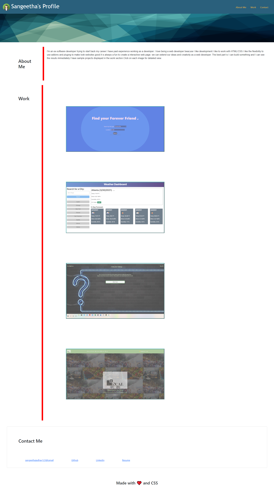

# My-Portfolio

This page is a my portfolio

## Description
The wesite has 4 main components

1.Header 
  The header component has my name , avatar and link to sections about me , work and contact me.
  
2.About me
   when the About Me in the header is clicked the page scrolls to the about me section.
   It contains a overview about the my skill and experience.
  
3. Work
     This section talks about some of my project. Clicking each image will be taken to deployed application.
     
 4. Contact Me
      This section contains information about contact details.
      
  ## Technologies Used
  
  HTML
  CSS
  JavaScript
  
  ## Features
  
1. Semantic HTML Structure  : The generic HTML elements used in this project  are replaced with  semantic elements, which clearly describes its meaning both the developer and the browser.

2. Description for an image tag  included :  Added "alt" attributes to   tag for better understanding of an image,if the image cannot be displayed.

3. Modified heading tag in sqential order : The heading tag included follows the sequential order.

4. Descriptive title added :  <title> tag is added and a descriptive title is given .

5. Organizd CSS selectors : CSS selectors and properties are consolidated and organized to follow semantic structure.
  
   ## Installation
On GitHub, navigate to the main page of the repository.
  To clone the repository using HTTPS, under "Clone with HTTPS", click . To clone the repository using an SSH key, including a certificate issued by your organization's SSH certificate authority, click Use SSH, then click clipboard image . To clone a repository using GitHub CLI, click Use GitHub CLI, then click clipboard image .

  open Git Bash
  
  Change the current working directory to the location where you want the cloned directory.
  
  Type git clone, and then paste the SSH  you copied earlier.

$ git clone  git@github.com:sangeethaNR/My_Portfolio.git
Press Enter to create your local clone.

$ git clone git@github.com:sangeethaNR/My_Portfolio.git
> Cloning into `Spoon-Knife`...
> remote: Counting objects: 10, done.
> remote: Compressing objects: 100% (8/8), done.
> remove: Total 10 (delta 1), reused 10 (delta 1)
> Unpacking objects: 100% (10/10), done.

 You installed the project to your local!!!
 
  Link to the deployed application https://github.com/sangeethaNR/My-Portfolio.git
  
  Landing Page  https://sangeethanr.github.io/My-Portfolio/
  Screenschot of how the landing page look like

  
  ## Credits
  github.com
  google.com
  w3Schools.com
  Scratch.mit.edu
  
